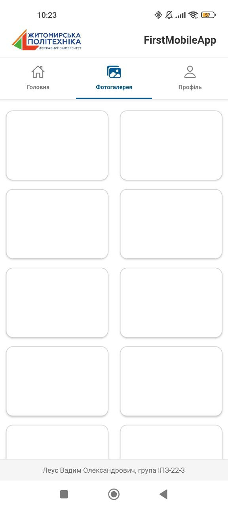
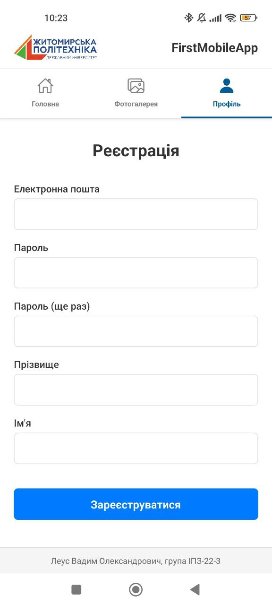

# Лабораторна робота №1: Основи React Native та Expo
**Тема:** Використання Expo для створення найпростішого додатку React Native. Знайомство з основними компонентами.  
## Студент: Леус Вадим (ІПЗ-22-3)
---

## Опис проєкту
Додаток **"FirstMobileApp"** розроблено з використанням фреймворку **React Native** та платформи **Expo**. 
Проєкт демонструє роботу з базовими компонентами UI, навігацією  та стилізацією.

### Реалізований функціонал:
1.  **Головна:** Стрічка новин університету з використанням компонента `FlatList`. Кожен елемент містить зображення, заголовок, дату та короткий опис.
2.  **Фотогалерея:** Реалізована сітка з двох колонок, що адаптується під ширину екрану.
3.  **Профіль:** Форма реєстрації користувача з полями введення та валідацією.
4.  **Компоненти:** Використано компонентний підхід.

---

## Скріншоти екранів

| Головна (Новини) | Фотогалерея | Профіль (Реєстрація) |
| :---: | :---: | :---: |
|  |  |  |


---

## Інструкція із запуску

Для запуску проєкту на локальній машині необхідно мати встановлений **Node.js**.

1.  **Клонування репозиторію:**
    ```bash
    git clone https://github.com/VadymLeus/MobileLabsRN2026
    cd MobileLabsRN2026/lab1
    ```

2.  **Встановлення залежностей:**
    ```bash
    npm install
    ```

3.  **Запуск локального сервера Expo:**
    ```bash
    npx expo start
    ```

4.  **Запуск на смартфоні:**
    * Встановіть додаток **Expo Go**.
    * Відскануйте QR-код, що з'явиться у терміналі.

### Вирішення проблем 
Якщо виникають проблеми з підключенням:
    Запустіть тунелювання:
    ```
    npx expo start --tunnel
    ```

---

## Способи запуску мобільного додатка

### 1. Фізичний пристрій  через Expo Go
Найзручніший спосіб для швидкої розробки.
* **Призначення:** Швидке тестування верстки, логіки та взаємодії з реальним залізом.
* **Особливості:**
    * Використовує додаток-клієнт Expo Go.
    * Код передається через Metro Bundler.
    * Підтримує миттєве оновлення при зміні коду.
* **Відмінності:** Максимально точне відображення продуктивності та UI. Не навантажує ПК, на відміну від емулятора. Потребує підключення до однієї Wi-Fi мережі або використання `--tunnel`.

### 2. Android Emulator
Запуск віртуального смартфона на ПК через Android Studio.
* **Призначення:** Тестування на різних версіях Android та різних розширеннях екрану без наявності фізичних девайсів.
* **Особливості:**
    * Вимагає увімкненої апаратної віртуалізації.
    * Дозволяє емулювати GPS, стан батареї, вхідні дзвінки.
* **Відмінності:** Споживає значні ресурси RAM та CPU комп'ютера. Може працювати повільніше за реальний телефон, якщо ПК слабкий. Ідеальний для налагодження специфічних помилок верстки.

### 3. Expo Snack
Хмарне середовище розробки.
* **Призначення:** Швидке створення прототипів без встановлення Node.js та Android Studio.
* **Особливості:** Працює прямо в браузері.
* **Відмінності:** Має обмежений функціонал порівняно з локальною розробкою, але дозволяє ділитися кодом за посиланням.