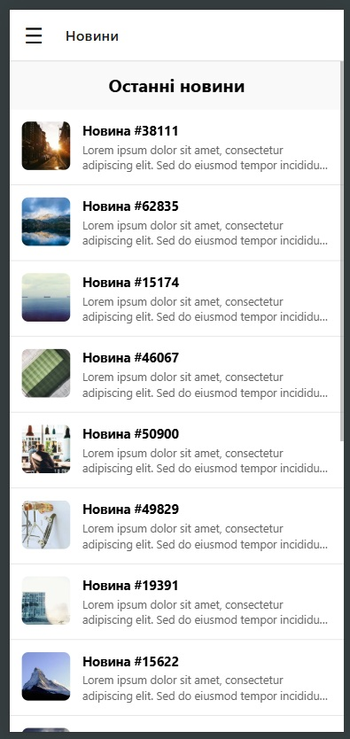
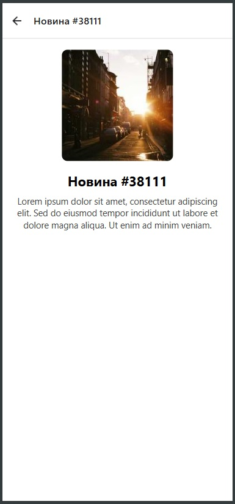
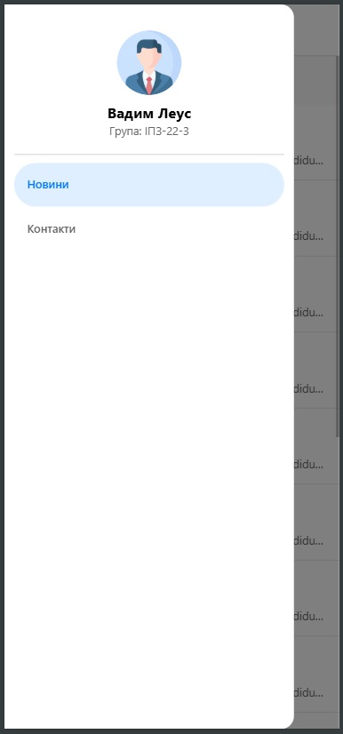
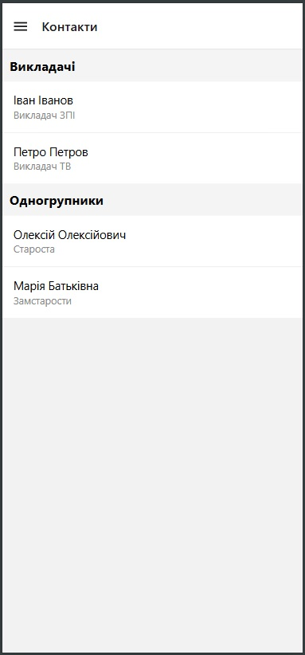

# Лабораторна робота №2: Вкладена навігація та віртуалізація списків
**Тема:** Побудова вкладеної навігації та оптимізація відображення великих списків у React Native із використанням компонентів FlatList та SectionList.
## Студент: Леус Вадим (ІПЗ-22-3)

---

## Опис проєкту
Додаток розроблено з використанням фреймворку **React Native** та платформи **Expo**. Проєкт демонструє просунуті техніки роботи з мобільними інтерфейсами, зокрема оптимізацію рендерингу великих масивів даних та побудову складної ієрархії екранів (Nested Navigation).

### Реалізований функціонал:
1. **Стрічка новин (MainScreen):** Використано оптимізований компонент `FlatList`. 
   * Реалізовано **Pull-to-Refresh** (оновлення свайпом вниз).
   * Реалізовано **Infinite Scroll** (нескінченне підвантаження даних при наближенні до кінця списку).
   * Додано Floating Action Button (кнопку швидкого повернення вгору при скролінгу).
2. **Екран деталей (DetailsScreen):** Динамічне відображення повної інформації про обрану новину з передачею параметрів через навігацію (`route.params`). Налаштовано динамічний заголовок екрану.
3. **Екран контактів (ContactsScreen):** Використано компонент `SectionList` для відображення списків, згрупованих за категоріями (Викладачі, Одногрупники).
4. **Вкладена навігація:** Успішно поєднано `Drawer Navigator` (бокове меню) та `Stack Navigator` (стекова навігація). 
   * Створено кастомне бокове меню (`CustomDrawer`) з профілем студента. 
   * Усунуто архітектурну проблему "подвійного хедера".

---

## Скріншоти екранів

| Головна (Новини) | Деталі (Stack) | Бокове меню (Drawer) | Контакти (SectionList) |
| :---: | :---: | :---: | :---: |
|  |  |  |  |

---

## Інструкція із запуску

Для запуску проєкту на локальній машині необхідно мати встановлений **Node.js**.

1. **Клонування репозиторію:**
   ```bash
   git clone https://github.com/VadymLeus/MobileLabsRN2026
   cd MobileLabsRN2026/lab2
   ```

2. **Встановлення залежностей:**
   ```bash
   npm install
   ```

3. **Запуск локального сервера Expo:**
   Оскільки проєкт використовує бібліотеки для анімацій та жестів (Reanimated, Gesture Handler), рекомендовано запускати сервер з очищенням кешу:
   ```bash
   npx expo start --clear
   ```

4. **Запуск на пристрої:**
   * Встановіть додаток **Expo Go** на ваш смартфон (переконайтеся, що він оновлений до останньої версії).
   * Відскануйте QR-код, що з'явиться у терміналі.
   
---

## Висновки

### 1. Чим відрізняється FlatList від ScrollView?
`ScrollView` рендерить абсолютно всі свої дочірні елементи одразу під час завантаження екрану. Якщо список містить сотні елементів, це призводить до значного падіння продуктивності та переповнення оперативної пам'яті (RAM). 
`FlatList` оптимізований для великих масивів даних: він рендерить лише ті елементи, які безпосередньо видно на екрані (плюс невеликий буфер), видаляючи з пам'яті ті, що залишилися поза зоною видимості.

### 2. Що таке віртуалізація списків?
Це архітектурний механізм оптимізації рендерингу. Під час скролінгу віртуалізований список (`FlatList` або `SectionList`) не створює нові UI-компоненти безкінечно. Натомість він бере компоненти, які "вийшли" за верхню межу екрану, очищає їх і перевикористовує для відображення нових даних, що з'являються знизу. Це тримає використання пам'яті на стабільно низькому рівні незалежно від довжини списку.

### 3. Як здійснюється передача параметрів між екранами?
У React Navigation передача параметрів відбувається під час виклику методу навігації, передаючи об'єкт з даними як другий аргумент:
`navigation.navigate('DetailsScreen', { item: selectedData })`. 
На цільовому екрані ці дані витягуються за допомогою об'єкта `route` (або хука `useRoute`): `const { item } = route.params;`.

### 4. Що таке вкладена навігація?
Вкладена навігація (Nested Navigation) — це патерн проєктування, при якому один навігатор розташовується всередині екрану іншого навігатора. Наприклад, у цій роботі `Stack Navigator` (відповідає за перехід від списку новин до деталей) є одним із маршрутів (екранів) батьківського `Drawer Navigator` (бічного меню). Це дозволяє будувати незалежні стеки історії для різних розділів додатку.

### 5. У яких випадках застосовується SectionList?
`SectionList` використовується тоді, коли масив даних логічно розбитий на категорії, підгрупи або секції, і кожна з них потребує власного заголовка. Наприклад: список контактів, згрупований за алфавітом; розклад занять, розбитий по днях тижня; або меню ресторану, поділене на "Перші страви", "Напої" тощо. Він автоматично обробляє рендеринг заголовків секцій (`renderSectionHeader`).
