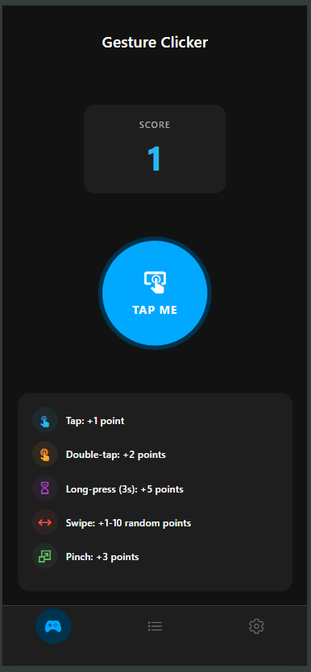
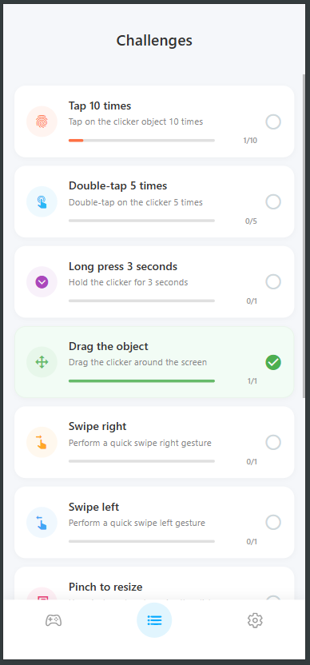
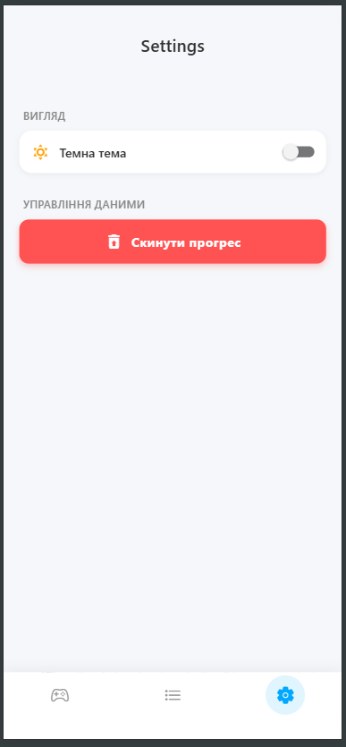

# Лабораторна робота №3: Кастомні жести та стилізація
**Тема:** Використання кастомних жестів у React Native та стилізація інтерфейсу мобільного застосунку.
## Студент: Леус Вадим (ІПЗ-22-3)

---

## Опис проєкту
Додаток **"Gesture Clicker"** розроблено з використанням фреймворку **React Native** та платформи **Expo**. Проєкт є інтерактивною грою-клікером, яка демонструє роботу зі складними жестами користувача, анімаціями, глобальним станом та підтримкою різних тем оформлення.

### Реалізований функціонал:
1. **Головний екран (Game):** Інтерактивний об'єкт та лічильник очок. Реалізовано обробку наступних жестів за допомогою `react-native-gesture-handler`:
   * `Tap` (коротке натискання) – додає 1 очко.
   * `Double Tap` (подвійний клік) – додає 2 очки.
   * `Long Press` (утримання 3 секунди) – бонусні 5 очок.
   * `Pan` (перетягування) – можливість вільно переміщувати об'єкт по екрану.
   * `Fling` (швидкий свайп вліво/вправо) – додає випадкову кількість очок (від 1 до 10).
   * `Pinch` (масштабування) – зміна розміру об'єкта та отримання 3 очок.
   * Анімації реакції на жести реалізовані через `react-native-reanimated`.
2. **Екран завдань (Challenges):** Динамічний список досягнень із прогрес-барами. 
   * Відстежується виконання 10 різних завдань (кількість тапів, свайпів, набір очок тощо).
   * Додано власні завдання: "Swipe Marathon" (зробити 20 свайпів) та "The Patient One" (5 довгих натискань).
   * Відображення статусу виконання (іконка чека та заповнений прогрес-бар).
3. **Екран налаштувань (Settings):**
   * Перемикач світлої та темної теми оформлення (динамічна стилізація всього застосунку).
   * Кнопка безпечного скидання прогресу з подвійним підтвердженням (Alert).
   * Збереження даних: інтегровано `AsyncStorage` для збереження очок, статистики завдань та обраної теми навіть після перезапуску додатку.
4. **Навігація:** Використано `Bottom Tab Navigator` для зручного перемикання між трьома основними екранами.

---

## Скріншоти екранів

| Гра | Завдання | Налаштування |
| :---: | :---: | :---: |
|  |  |  |

---

## Інструкція із запуску

Для запуску проєкту на локальній машині необхідно мати встановлений **Node.js**.

1. **Клонування репозиторію:**
   ```bash
   git clone [https://github.com/VadymLeus/MobileLabsRN2026.git](https://github.com/VadymLeus/MobileLabsRN2026.git)
   cd MobileLabsRN2026/lab3
   ```

2. **Встановлення залежностей:**
   Окрім стандартних пакетів, проєкт використовує бібліотеки для жестів, анімацій та локального сховища.
   ```bash
   npm install
   ```

3. **Запуск локального сервера Expo:**
   Оскільки використовуються `Reanimated` та `Gesture Handler`, рекомендовано скинути кеш під час старту:
   ```bash
   npx expo start --clear
   ```

4. **Запуск на пристрої:**
   * Встановіть додаток **Expo Go** на ваш смартфон.
   * Відскануйте QR-код, що з'явиться у терміналі.

---

## Висновки

### 1. Які інструменти використовуються для обробки жестів у React Native?
Хоча базовий React Native має вбудовані компоненти на кшталт `TouchableWithoutFeedback` або `PanResponder`, сучасним стандартом є бібліотека `react-native-gesture-handler`. Вона обробляє жести (Tap, Pan, Pinch, Fling тощо) на нативному рівні (в UI-потоці), що забезпечує значно вищу продуктивність і плавність без затримок з боку JavaScript-потоку. У поєднанні з `react-native-reanimated` це дозволяє створювати складні взаємодії зі швидкістю 60 FPS.

### 2. Як поєднати кілька жестів на одному об'єкті?
Для цього використовується компонент `GestureDetector` та методи композиції жестів. У лабораторній роботі застосовано:
* `Gesture.Exclusive(doubleTap, singleTap)` — гарантує, що подвійний тап не викличе одиночний.
* `Gesture.Race()` — визначає, який жест розпочався першим (наприклад, між тапами та свайпами).
* `Gesture.Simultaneous()` — дозволяє жестам працювати одночасно (наприклад, перетягування `Pan` та масштабування `Pinch`).

### 3. Як реалізовано підтримку темної та світлої теми?
Реалізація виконана за допомогою **Context API** та динамічної стилізації. Створено глобальний стан `isDarkMode`. У кожному компоненті стилі застосовуються умовно у вигляді масиву: `style={[styles.container, isDarkMode && styles.containerDark]}`. Це дозволяє миттєво перемикати палітру кольорів по всьому додатку без необхідності перезавантажувати екрани.

### 4. Як забезпечується збереження даних гри після виходу з додатку?
Для збереження прогресу (очок, виконаних завдань) та налаштувань (обраної теми) використано `@react-native-async-storage/async-storage`. Це асинхронне, нешифроване сховище ключ-значення, яке зберігає дані локально на пристрої. За допомогою хука `useEffect` додаток зчитує збережені дані при першому запуску (`getItem`), і автоматично записує нові значення (`setItem`) щоразу, коли глобальний стан змінюється.