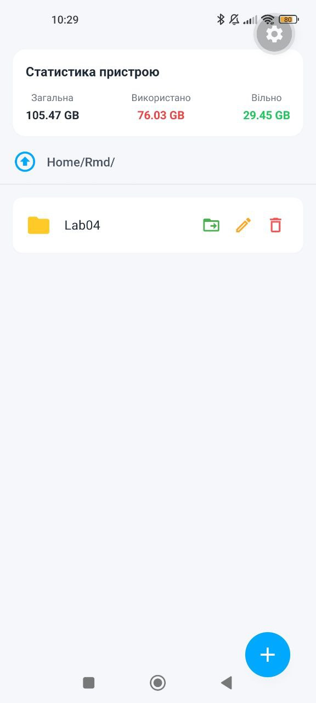
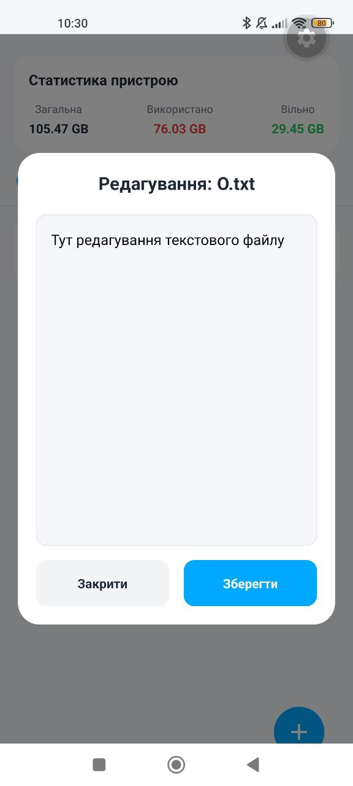
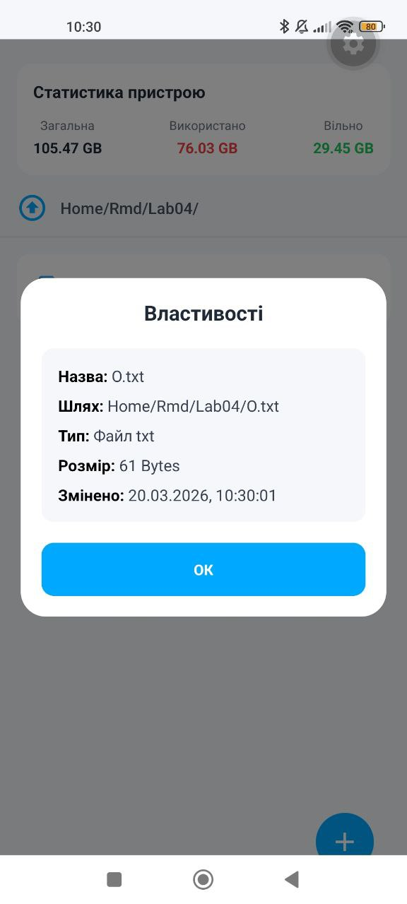

# Лабораторна робота №4: Робота з файловою системою
**Тема:** Опанування механізмів роботи з локальною файловою системою мобільного пристрою, використовуючи можливості бібліотеки `expo-file-system`.
## Студент: Леус Вадим (ІПЗ-22-3)

---

## Опис проєкту
Додаток **"Mobile File Manager"** розроблено на базі **React Native** та платформи **Expo**. Проєкт є повноцінним провідником, який дозволяє керувати локальними файлами додатка, переглядати статистику пам'яті пристрою та виконувати базові операції над текстовими документами.

### Використані технології:
* **Tailwind CSS (NativeWind):** для швидкої та адаптивної стилізації інтерфейсу.
* **Expo FileSystem (Legacy API):** для стабільної роботи з файловою системою в останніх версіях SDK.
* **Component-Based Architecture:** проєкт розділений на модулі (components, modals, screens, utils) для чистоти коду.

### Реалізований функціонал:
1.  **Навігація (Navigation):**
    * Відображення вмісту поточної директорії через `FlatList`.
    * Інтерактивний рядок шляху (Breadcrumbs) із автоматичним декодуванням кирилиці.
    * Механізм переходу "вгору" та вкладена навігація по папках.
2.  **Керування файлами (CRUD):**
    * Створення нових папок та текстових файлів (`.txt`).
    * Вбудований редактор для зчитування та модифікації вмісту файлів.
    * Видалення об'єктів із обов'язковим підтвердженням (Alert).
    * **Додатково:** Реалізовано функцію перейменування та переміщення файлів (Cut & Paste).
3.  **Інформація та статистика:**
    * Перегляд детальних властивостей: назва, шлях, тип, розмір та дата останньої зміни.
    * Моніторинг пам'яті: відображення загального, вільного та зайнятого обсягу сховища пристрою в реальному часі.

---

## Архітектура проєкту
Код структуровано за принципами модульності:
* `src/components/` — базові елементи інтерфейсу (FileItem, StorageStats, MoveBar).
* `src/components/modals/` — окремі компоненти для кожного модального вікна.
* `src/screens/` — головна логіка та стан застосунку (MainScreen).
* `src/utils/` — допоміжні функції (форматування байтів).

---

## Скріншоти роботи застосунку

| Головний екран | Створення та редагування | Властивості об'єкта |
| :---: | :---: | :---: |
|  |  |  |

---

## Інструкція із запуску

Для запуску проєкту необхідно мати встановлений **Node.js**.

1.  **Клонування репозиторію:**
    ```bash
    git clone [https://github.com/VadymLeus/MobileLabsRN2026.git](https://github.com/VadymLeus/MobileLabsRN2026.git)
    cd MobileLabsRN2026/lab4
    ```

2.  **Встановлення залежностей:**
    ```bash
    npm install
    ```

3.  **Запуск локального сервера Expo:**
    Через використання NativeWind та налаштувань Babel, рекомендується очистити кеш при старті:
    ```bash
    npx expo start -c
    ```

4.  **Запуск на пристрої:**
    * Встановіть додаток **Expo Go** на смартфон.
    * Відскануйте QR-код із терміналу.

---

## Висновки

### 1. Чому важливо використовувати `decodeURIComponent` при роботі з шляхами?
Методи `expo-file-system` повертають шляхи у форматі URI, де спецсимволи (пробіли, кирилиця) замінюються на відсоткові коди (наприклад, `%20`). Для коректного відображення назв користувачеві в Breadcrumbs або вікні інформації необхідно розкодовувати ці рядки.

### 2. Як реалізовано переміщення файлів?
Замість складного Drag & Drop використано патерн "Move & Paste". При натисканні на іконку переміщення об'єкт зберігається у стані `movingItem`. Користувач переходить у будь-яку іншу директорію, де натискає "Вставити". Програма використовує `moveAsync`, переміщуючи файл за новим шляхом зі старим іменем.

### 3. Як розраховується статистика пам'яті?
Для отримання обсягу використаного простору ми зчитуємо загальну ємність (`getTotalDiskCapacityAsync`) та обсяг вільного місця (`getFreeDiskStorageAsync`). Різниця між цими значеннями і є обсягом зайнятої пам'яті. Ці дані оновлюються щоразу при завантаженні директорії або видаленні файлів.

### 4. Переваги розділення App.js на компоненти?
Розділення коду на окремі файли (Screens, Modals, Components) значно полегшує підтримку проєкту. Це дозволяє уникнути антипатерну "God Object", де один файл відповідає і за логіку FS, і за верстку п'яти модальних вікон. Такий підхід робить компоненти перевикористовуваними та полегшує пошук помилок.