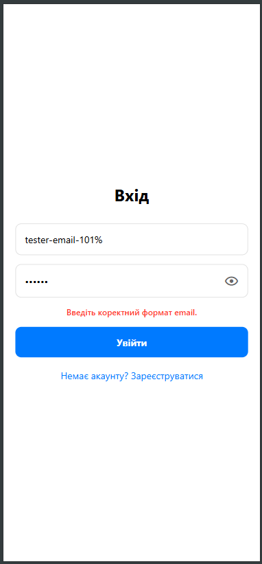
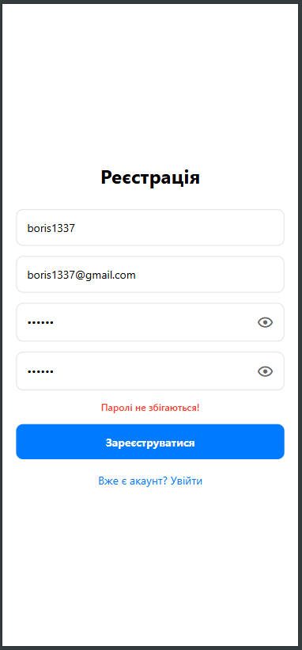
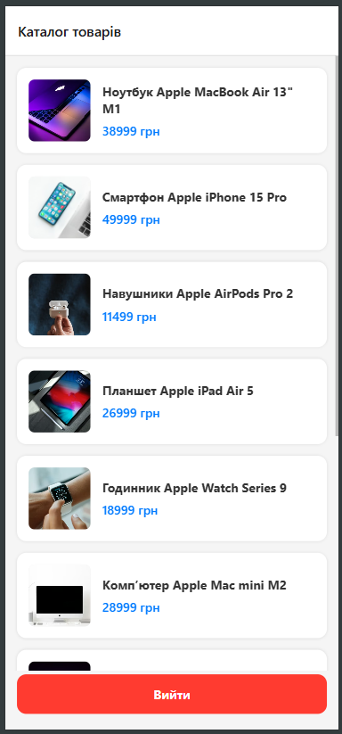
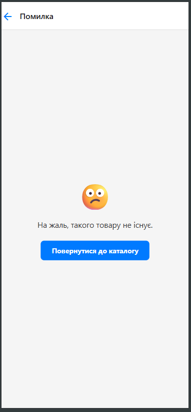

# Лабораторна робота №5: Побудова навігації в Expo Router
**Тема:** Побудова навігації у React Native із використанням бібліотеки Expo Router та ознайомлення з концепцією file-based маршрутизації.
## Студент: Леус Вадим (ІПЗ-22-3)

---

## Опис проєкту
Додаток **"Apple Store Navigator"** розроблено на базі **React Native** та платформи **Expo**. Проєкт демонструє побудову сучасної file-based навігації за допомогою **Expo Router**, реалізацію захищених маршрутів, динамічну маршрутизацію та керування глобальним станом авторизації користувача.

### Використані технології:
* **Expo Router:** сучасна бібліотека маршрутизації (аналог Next.js для мобільних додатків) з використанням Layouts та груп маршрутів.
* **React Context API:** для створення глобального стану авторизації (`AuthContext`).
* **AsyncStorage:** для збереження сесії користувача локально (щоб стан входу не скидався при перезавантаженні сторінки або додатку).
* **MaterialCommunityIcons:** для графічного оформлення UI-елементів (наприклад, іконки видимості пароля).

### Реалізований функціонал:
1.  **Публічні екрани (Auth Flow):**
    * Екрани входу (`login`) та реєстрації (`register`).
    * Інтерактивні форми з базовою валідацією (перевірка порожніх полів, формату email, збігу паролів) та кастомним inline-виводом помилок.
    * Перемикач видимості пароля (іконка "око").
2.  **Захищена навігація (Protected Routes):**
    * Обгортка `_layout.jsx` автоматично перевіряє стан `isAuthenticated`. Неавторизовані користувачі примусово перенаправляються на сторінку входу через компонент `<Redirect />`.
    * Після успішного входу відбувається `router.replace('/(app)')`.
3.  **Головний екран (Каталог):**
    * Рендеринг списку товарів (техніка Apple з реальними фотографіями) через `FlatList`.
    * Кнопка безпечного виходу (`logout`) із системним підтвердженням (Alert/confirm) та подальшим очищенням `AsyncStorage`.
4.  **Динамічна маршрутизація:**
    * Екран деталей товару (`[id].jsx`), який отримує ID з URL-параметрів та відображає відповідну інформацію.
    * Перевизначення стандартної кнопки "Назад" у `Stack.Screen` для коректної роботи в браузері (після F5).
    * Обробка відсутніх товарів з красивим UI та кнопкою повернення.
5.  **Глобальна 404 помилка:**
    * Кастомізований файл `+not-found.jsx` для обробки невідомих URL-шляхів із пропозицією повернутися на головну.

---

## Архітектура проєкту (File-based routing)
Структура директорії `app/` є маніфестом навігації:
* `app/(auth)/` — група публічних маршрутів (ігнорується в URL).
* `app/(app)/` — група захищених маршрутів (містить каталог та деталі).
* `app/(app)/details/[id].jsx` — динамічний маршрут для конкретного товару.
* `context/AuthContext.jsx` — логіка керування користувацькою сесією.

---

## Скріншоти роботи застосунку

**Авторизація та навігація**
| Вхід | Реєстрація | Каталог товарів |
| :---: | :---: | :---: |
|  |  |  |

**Деталі та обробка помилок**
| Деталі товару | 404 Сторінка |
| :---: | :---: |
|  |  |

---

## Інструкція із запуску

Для запуску проєкту необхідно мати встановлений **Node.js**.

1.  **Клонування репозиторію:**
    ```bash
    git clone [https://github.com/VadymLeus/MobileLabsRN2026.git](https://github.com/VadymLeus/MobileLabsRN2026.git)
    cd MobileLabsRN2026/lab5
    ```

2.  **Встановлення залежностей:**
    ```bash
    npm install
    ```

3.  **Запуск локального сервера Expo:**
    Рекомендується запускати з очищенням кешу маршрутизатора:
    ```bash
    npx expo start -c
    ```

4.  **Запуск на пристрої:**
    * Встановіть додаток **Expo Go** на смартфон.
    * Відскануйте QR-код із терміналу.

---

## Висновки (Відповіді на контрольні запитання)

### 1. Яким чином за допомогою Expo Router реалізується перенаправлення неавторизованого користувача?
В Expo Router для цього використовується архітектурний патерн `Layouts`. У файлі `_layout.jsx` відповідної групи (наприклад, захищеної групи `(app)`) зчитується стан авторизації з глобального контексту. Якщо користувач не авторизований (`isAuthenticated === false`), компонент повертає `<Redirect href="/login" />`, що миттєво перериває рендеринг захищених екранів і перекидає користувача на сторінку входу.

### 2. У чому полягає різниця між використанням компонента `<Link>` та метода `router.push()`?
* Компонент **`<Link>`** є декларативним. Він ідеально підходить для створення стандартних навігаційних елементів у верстці (наприклад, посилання "Зареєструватися" або огортання картки товару).
* Метод **`router.push()`** (або `router.replace()`) є імперативним. Він використовується всередині JavaScript-функцій та обробників подій (наприклад, програмний перехід *після* натискання кнопки "Увійти" та успішної валідації даних).

### 3. Як працюють динамічні маршрути в Expo Router і як отримати передані параметри?
Динамічні маршрути створюються за допомогою квадратних дужок у назві файлу (наприклад, `[id].jsx`). Expo Router розуміє, що це змінна частина URL-шляху. Усередині самого компонента екрану ці передані параметри витягуються за допомогою спеціального хука **`useLocalSearchParams()`** (наприклад: `const { id } = useLocalSearchParams();`).

### 4. Чому стан авторизації доцільно зберігати у глобальному контексті (React Context), а не в локальному стані компонента?
Стан авторизації впливає на весь застосунок: на маршрутизацію (дозволяти доступ чи ні), на відображення UI (кнопка "Вийти" в шапці) та на запити до даних. Якби стан зберігався локально в компоненті `Login`, інші екрани (наприклад, каталог чи макети) не мали б до нього доступу без складного передавання пропсів ("prop drilling"). Глобальний контекст робить `isAuthenticated` та методи `login`/`logout` доступними з будь-якої точки додатка.

### 5. Для чого використовуються групи маршрутів `(folderName)` і як вони впливають на URL-адресу?
Групи маршрутів дозволяють логічно організувати файли проєкту та застосовувати окремі Layouts до певного набору екранів (наприклад, один макет для авторизації, інший для захищеної зони). Їхня головна особливість у тому, що назва папки в круглих дужках **повністю ігнорується у кінцевій URL-адресі**. Тобто файл `app/(auth)/login.jsx` буде доступний за коротким і чистим шляхом `/login`, а не `/(auth)/login`.