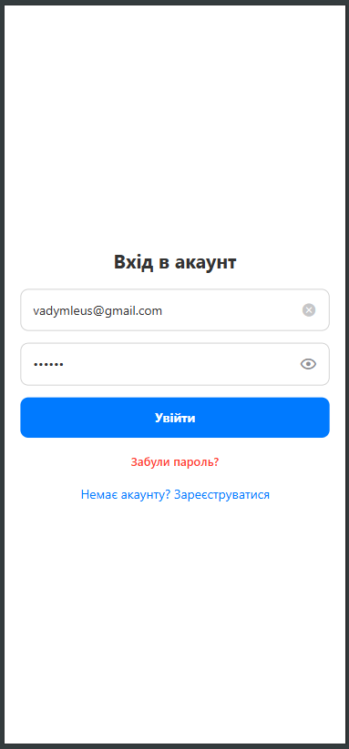
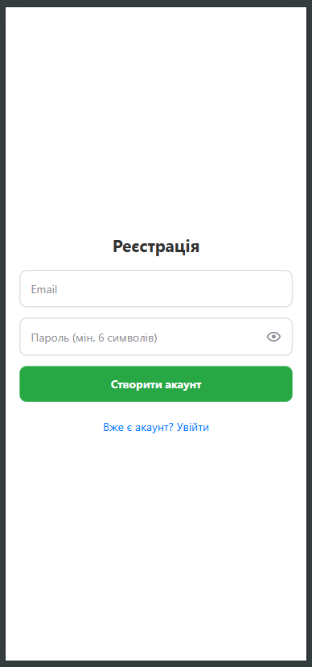
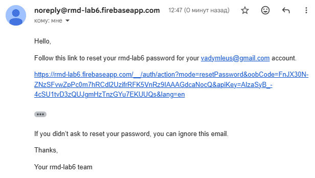
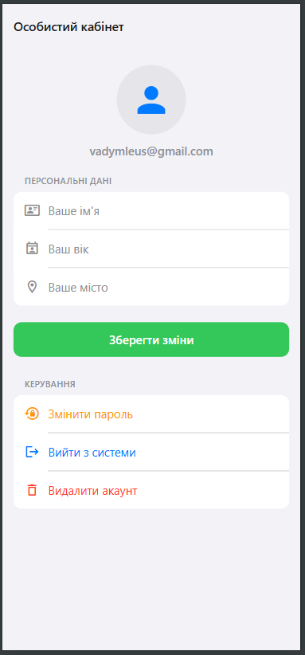
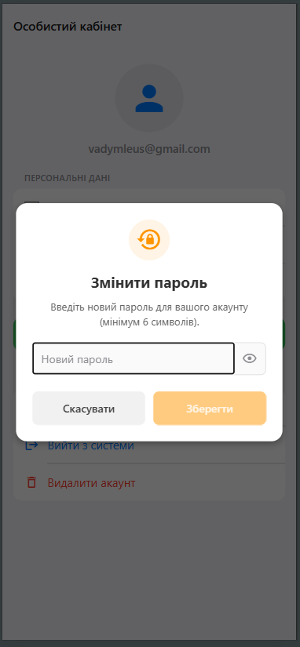
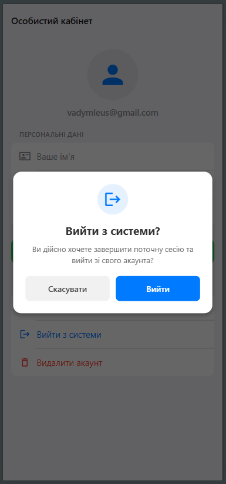
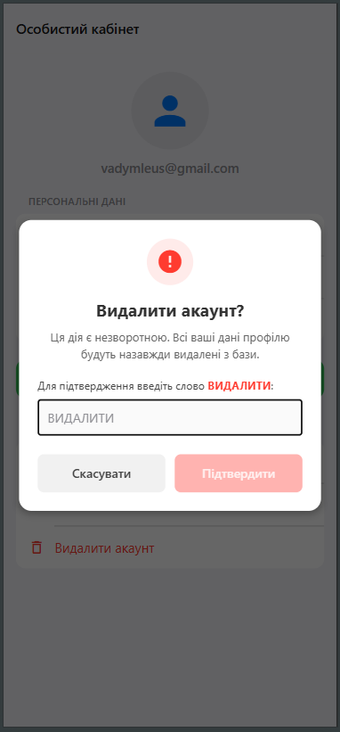

# Лабораторна робота №6: Побудова авторизації та збереження персональних даних у React Native

**Тема:** Побудова авторизації та збереження персональних даних у React Native з використанням Firebase Authentication та Firestore.
## Студент: Леус Вадим (ІПЗ-22-3)

---

## Опис проєкту
Мобільний додаток розроблено на базі **React Native** та платформи **Expo**. Проєкт є повноцінною клієнт-серверною інтеграцією, що демонструє роботу з хмарними сервісами **Firebase** для забезпечення безпечної авторизації та управління персональними даними користувачів у реальному часі.

### Використані технології:
* **Firebase Authentication:** сервіс для безпечної реєстрації, авторизації та відновлення паролів користувачів.
* **Firebase Firestore:** NoSQL хмарна база даних для збереження інформації профілів.
* **Expo Router:** забезпечення захищеної file-based навігації.
* **React Context API:** централізоване управління станом сесії (`AuthContext`), підключене до слухача Firebase `onAuthStateChanged`.

### Реалізований функціонал:
1.  **Авторизація користувача:**
    * Реєстрація та вхід за допомогою email та пароля.
    * Безпечний вихід із системи з попереднім підтвердженням через кастомне модальне вікно.
    * Обробка та локалізація помилок Firebase (наприклад, "Невірний пароль", "Email вже існує") безпосередньо в UI форм.
2.  **Збереження персональних даних:**
    * Форма профілю для введення/редагування імені, віку та міста.
    * Дані автоматично синхронізуються з базою Firestore.
    * Зв'язок забезпечується через використання унікального ідентифікатора користувача (`uid`) як назви документа в колекції `users`.
3.  **Захист доступу (Security Rules):**
    * Реалізовано перевірку доступу на клієнті через захищені маршрути Expo Router `(app)`.
    * Налаштовано Firestore Security Rules на стороні сервера: запис і читання дозволені лише за умови `request.auth != null && request.auth.uid == userId`.
4.  **Керування обліковим записом (Редагування та Видалення):**
    * Кастомне захищене модальне вікно для видалення акаунту (потребує введення слова "ВИДАЛИТИ" для підтвердження).
    * Повне каскадне видалення: спочатку видаляється документ з Firestore, потім — запис у Firebase Auth.
    * Обробка помилки `auth/requires-recent-login` (примусовий вихід для повторної авторизації перед небезпечними діями).
5.  **Управління паролем:**
    * Відновлення пароля на email через API `sendPasswordResetEmail` (з екрану входу).
    * Безпечна зміна пароля безпосередньо з особистого кабінету через метод `updatePassword`.

---

## Скріншоти роботи застосунку

**Екрани авторизації**
| Вхід | Реєстрація | Відновлення (пошта) |
| :---: | :---: | :---: |
|  |  |  |

**Особистий кабінет та керування даними**
| Профіль користувача | Зміна пароля |
| :---: | :---: |
|  |  |

**Захисні модальні вікна**
| Підтвердження виходу | Підтвердження видалення |
| :---: | :---: |
|  |  |

---

## Інструкція із запуску

Для запуску проєкту необхідно мати встановлений **Node.js** та налаштований проєкт у Firebase Console.

1.  **Клонування репозиторію:**
    ```bash
    git clone [https://github.com/VadymLeus/MobileLabsRN2026.git](https://github.com/VadymLeus/MobileLabsRN2026.git)
    cd MobileLabsRN2026/lab6
    ```

2.  **Встановлення залежностей:**
    ```bash
    npm install
    ```

3.  **Налаштування Firebase:**
    * Переконайтеся, що у корені проєкту існує файл `firebaseConfig.js`.
    * Файл містить валідні ключі вашого веб-додатку з Firebase Console (з увімкненими Authentication та Firestore).

4.  **Запуск локального сервера Expo:**
    ```bash
    npx expo start -c
    ```

5.  **Запуск на пристрої:**
    * Встановіть додаток **Expo Go** на смартфон або використовуйте веб-браузер.
    * Відскануйте QR-код із терміналу.

---

## Висновки

### 1. Як саме Firestore пов'язує персональні дані з конкретним користувачем Firebase Auth?
Зв'язок реалізується архітектурно на етапі створення запиту. Замість того, щоб дозволяти Firestore автоматично генерувати випадкові ID для документів, ми використовуємо унікальний ідентифікатор користувача (`user.uid`), отриманий з об'єкта авторизації. Звернення до бази виглядає як `doc(db, 'users', user.uid)`. Це гарантує, що один користувач матиме рівно один документ у колекції `users`.

### 2. Чому недостатньо просто приховати чужі дані в інтерфейсі (клієнтському коді), а необхідно використовувати Firestore Security Rules?
Клієнтський код (мобільний додаток чи веб-сайт) є вразливим. Зловмисник може легко витягнути ключі `firebaseConfig` з відкомпільованого коду, написати власний скрипт і надіслати прямий запит до бази даних API Firebase. Firestore Security Rules працюють на стороні серверів Google і гарантують, що запит буде відхилено, якщо `uid` авторизованого токена не збігається з ID документа, незалежно від того, звідки надійшов цей запит.

### 3. Що таке помилка `auth/requires-recent-login` і навіщо Firebase її генерує?
Це механізм захисту Firebase від несанкціонованого доступу. Якщо користувач увійшов у систему дуже давно (сесія тримається місяцями завдяки AsyncStorage/IndexedDB), то для виконання "небезпечних" дій (таких як зміна пароля, зміна пошти або повне видалення акаунту), Firebase вимагає "свіжої" аутентифікації. Це гарантує, що пристрій не потрапив до чужих рук у розблокованому стані. У додатку ця помилка перехоплюється, і користувачу пропонується перелогінитись.

### 4. У чому перевага використання `onAuthStateChanged` всередині AuthContext?
Метод `onAuthStateChanged` є "слухачем" (listener), який працює у фоновому режимі та автоматично реагує на будь-які зміни стану сесії (наприклад, примусове відключення токена сервером, успішний логін або вихід). Використання його в `AuthContext` дозволяє одноразово ініціалізувати цю перевірку при старті додатку і миттєво оновлювати UI (маршрутизацію) на всіх екранах синхронно, без необхідності вручну перевіряти токени перед кожним переходом.

### 5. Як працює метод `setDoc` з параметром `{ merge: true }` при збереженні профілю?
Коли користувач вперше заходить у додаток, його документа у Firestore ще не існує. Якщо використати `updateDoc`, Firebase видасть помилку, оскільки оновлювати нічого. Якщо використати звичайний `setDoc`, він повністю перезапише існуючий документ (видаливши поля, які ми не передали). Параметр `{ merge: true }` робить запит універсальним: якщо документа немає — він його створює, а якщо є — оновлює лише ті поля, які ми передали у формі, не зачіпаючи інші потенційні дані в документі.